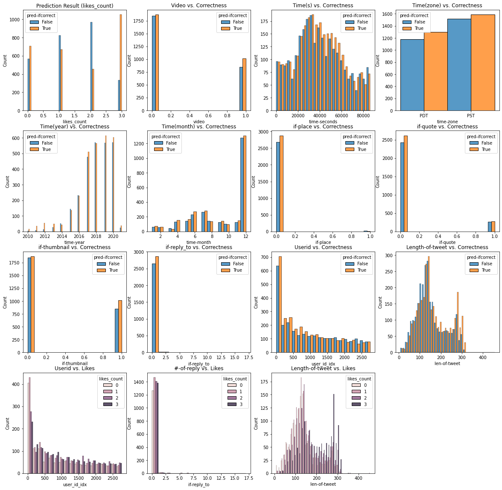
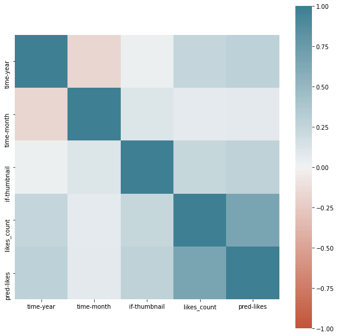

# Kaggle Instruction

## TRAIN MODEL:
- change the absolute path inside `main_twitter_like.py`
- you may modify any parameters inside `main_twitter_like.py` to produce a different model 
- run `main_twitter_like.py`, and it should auto generate models and predictions under `output/` folder (autogenerated)

## Misc:
- uncomment analysis inside `main_twitter_like.py` to see model effectiveness
- use `twitter_thumbnail_downloader.ipynb` to download images (WARNING: > 2G) => not used in this submission
- `jx_pytorch_lib.py` and `jx_lib.py` are two libs created and used throughout all assignments
- use `test_twitter_like_postanalysis.py` to use the saved models and generate plots related to the model performance
- The best model: [model-latest-v1-emphasize-rebuild-final.pt](output/dev-1-final-run2/models/model-latest-v1-emphasize-rebuild-final.pt) 
- 10% Training Summary Plot: (from `output/analysis` folder generated by `test_twitter_like_postanalysis.py`) 
- 
- ![training_progress[latest-v1-emphasize-rebuild]](output/dev-1-final-run2/analysis/training_progress[latest-v1-emphasize-rebuild].png)
- ''
